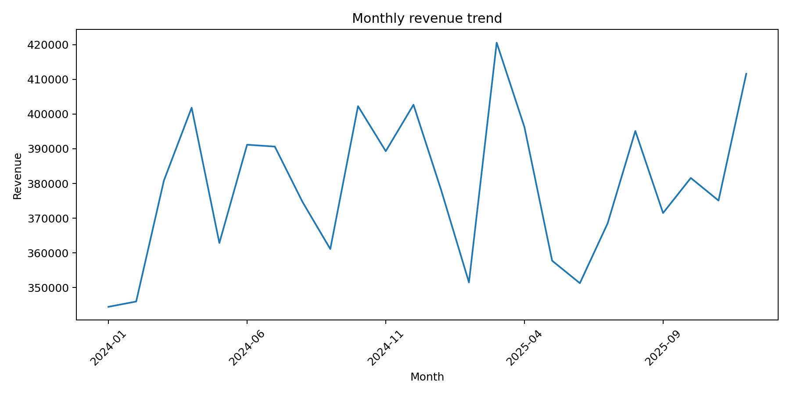
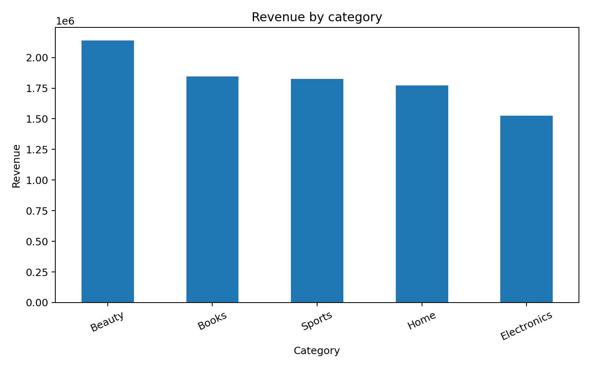
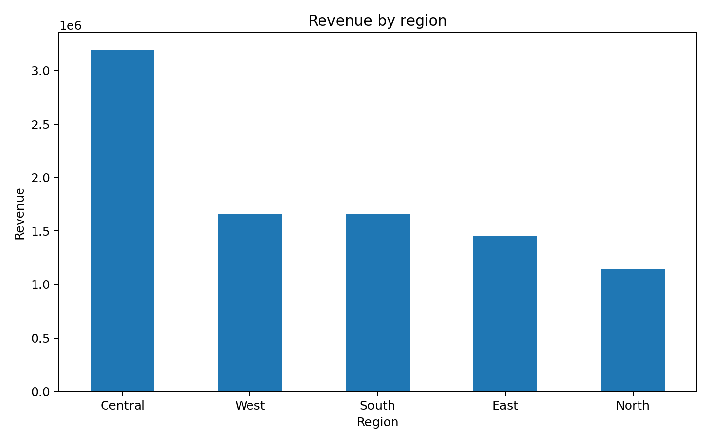
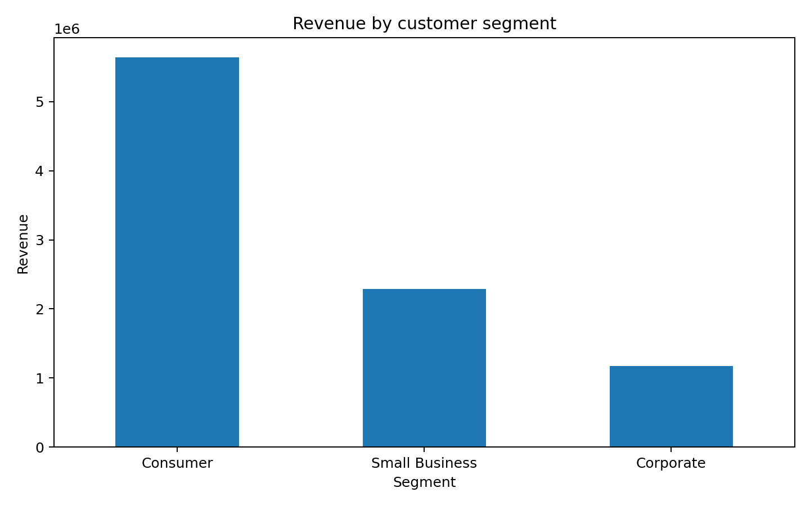
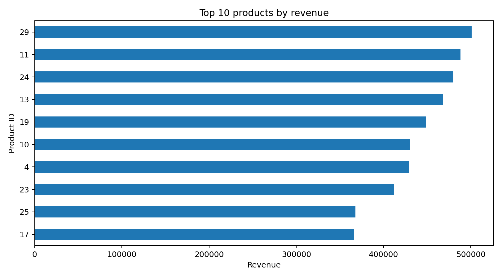
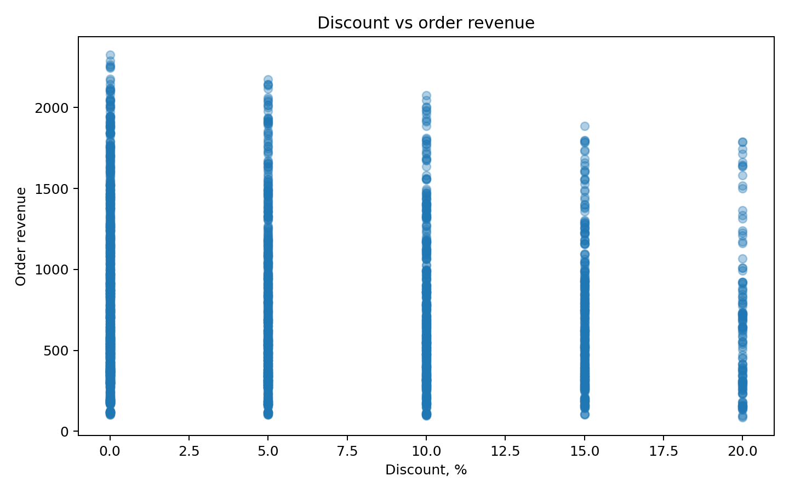

# Sales Dashboard

SQL-аналитика продаж и подготовка данных для интерактивного BI-дашборда.

> **Данные синтетические.** Проект создан для демонстрации навыков SQL, PostgreSQL, расчёта KPI и подготовки аналитического слоя для Power BI.

## Цель

Проанализировать продажи по времени, категориям, регионам и сегментам клиентов, подготовить набор SQL-запросов для аналитики и сформировать основу для Power BI dashboard.

## Стек

- PostgreSQL
- SQL
- Power BI
- DAX
- Python / pandas — для проверки и анализа данных

## Dataset

В проекте используются:

- **12 000 заказов**;
- **4 000 клиентов**;
- **30 товаров**;
- период **2024–2025**.

### Таблицы

```text
customers
    │
    └── customer_id
            │
            ▼
         orders
            │
            └── product_id
                    │
                    ▼
                 products
```

### Основные поля orders

- `order_id`
- `order_date`
- `customer_id`
- `product_id`
- `quantity`
- `discount_pct`
- `unit_price`
- `revenue`
- `region`
- `customer_segment`

## SQL workflow

```text
Raw CSV
   ↓
PostgreSQL
   ↓
Data model
   ↓
SQL transformations
   ↓
Analytical dataset
   ↓
Power BI
   ↓
Dashboard
```

## SQL

В папке `sql/`:

- `schema.sql` — создание таблиц;
- `analysis.sql` — аналитические запросы;
- `powerbi_dataset.sql` — подготовка датасета для Power BI.

Используемые конструкции:

- `JOIN`;
- `GROUP BY`;
- `CASE WHEN`;
- агрегатные функции;
- CTE;
- оконные функции;
- расчёт KPI;
- временные агрегации.

## Основные KPI

| KPI | Значение |
|---|---:|
| Orders | 12 000 |
| Revenue | 9 106 553.55 |
| Average Order Value | 758.88 |
| Units Sold | 30 024 |
| Products | 30 |
| Customers | 4 000 |

Значения рассчитаны на синтетических данных проекта.

## Визуальный анализ

### Динамика выручки



График показывает изменение выручки по месяцам и позволяет искать сезонность и периоды роста/снижения продаж.

### Выручка по категориям



Лидер по выручке — категория **Beauty**, её доля составляет **23.48%** общей выручки.

### Выручка по регионам



### Выручка по сегментам



### Top-10 товаров



### Discount vs order revenue




## Power BI Dashboard

В проекте разработан интерактивный аналитический dashboard в Power BI для анализа продаж.

**Что реализовано:**

* загрузка и подготовка данных в Power Query;
* построение модели данных из таблиц `orders`, `products` и `customers`;
* настройка связей между таблицами;
* создание DAX measures для расчёта основных KPI;
* анализ динамики выручки;
* анализ продаж по категориям, регионам и клиентским сегментам;
* Top-10 товаров по выручке;
* интерактивные фильтры по дате, категории, региону и сегменту.

**Основные KPI:**

* Total Revenue — 9.11M;
* Total Orders — 12,000;
* Average Order Value — 758.88;
* анализ продаж по 30 продуктам.

### DAX

```DAX
Total Revenue =
SUMX(
    orders,
    orders[quantity] * orders[unit_price] * (1 - orders[discount])
)

Total Orders =
DISTINCTCOUNT(orders[order_id])

Units Sold =
SUM(orders[quantity])

Average Order Value =
DIVIDE(
    [Total Revenue],
    [Total Orders]
)
```

### Dashboard structure

1. KPI cards — основные показатели продаж.
2. Revenue Trend — динамика выручки во времени.
3. Revenue by Category — структура продаж по категориям.
4. Revenue by Region — сравнение регионов.
5. Revenue by Segment — анализ клиентских сегментов.
6. Top-10 Products — наиболее доходные товары.
7. Slicers — интерактивная фильтрация данных.

## Ключевые выводы

1. Общая выручка синтетического набора — 9.11 млн условных единиц.
2. Средний чек — 758.88.
3. Beauty — крупнейшая категория по выручке.
4. Региональные и клиентские сегменты позволяют сравнивать структуру продаж.
5. Динамика по месяцам может использоваться для поиска сезонности и периодов изменения спроса.

## Ограничения

- данные синтетические;
- денежные значения являются условными;
- результаты не отражают показатели реального бизнеса;
- без реального контекста нельзя делать выводы о причинах изменения продаж.

## Запуск PostgreSQL

Создать базу данных, затем выполнить:

```bash
psql -d sales_dashboard -f sql/schema.sql
```

После загрузки CSV выполнить аналитические запросы:

```bash
psql -d sales_dashboard -f sql/analysis.sql
```
